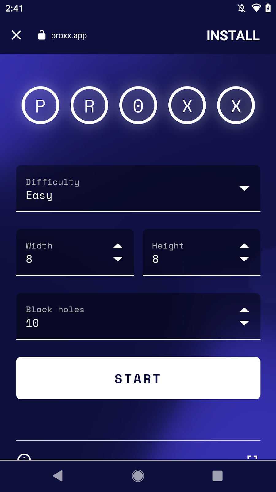

# Web Install API Explainer

This explainer is in its very early stages.
At the moment we’re hoping to assess the appetite for this feature and gather ideas and concerns before moving onto implementation details.

## TL;DR

This API would allow a website to request the installation of another website.

## Why do we want this?

Installable Web Apps are great for users. They:

* can link to and from the rest of the internet and be easily shared.
* allow app developers to focus their investments on a single, open platform.
* allow users to try the app before installing.
* benefit from the security and privacy considerations of the web platform.

Discoverability and installability are linked, with discoverability being what brings a user initially to a web app and installability being how the user engages with that web app longer term.
By allowing 3rd parties to install web apps, we strengthen the value of sites such as [PWA Directory][pwa-directory] and [findPWA][find-pwa] and in turn increase web app discoverability.
With the growth of web app catalogues it becomes easier to rate, compare and contrast web apps, and therefore for users to find suitable sites.

Building on that, these catalogues themselves can be compared and contrasted as part of an open ecosystem.
The Web Install API would let users pick where they get their apps from and ultimately democratise installation.

In their use of technology today, younger generations have been trained to look for what they want in app stores, and the web is falling behind in this regard.
While searchable and linkable, it is not seen as the place to get apps and without the strengthening of websites such as [Appscope][appscope], we could continue to lose out.

We also enable the use case of a publisher with a suite of web apps to allow installation from one combined place.
This encourages sites to split their functionality across multiple domains, moving away from monolithic apps and providing stronger origin isolation and more granular permissions.

In summary, adding a Web Install API strengthens the web by keeping it relevant as a place to discover apps and encourages users to use apps based on open, shareable and secure technologies.

## Privacy and Security concerns

### Protecting the user from the directory

If we allowed any website to arbitrarily start installing things on the user’s device it would be wide open to abuse.
We have a few (non mutually exclusive) options for limiting this potential:

* **Permission** - we could create a “this website can install other websites” permission.
* **Browser Prompt** - the user could be presented with some UI before installation.
* **User Gesture** - the installation must be triggered with a user gesture on the page.
* **Website Trust** - some heuristic based on the reputation of the website could be used.

### Protecting the user from the web app

Browsers may have criteria to determine whether a website is installable (for example, see the requirements for PWA installability [here][installable-reqs]).
We want to keep these requirements consistent, so browsers may want to check the website to be installed.

### Protecting the web app from the directory

Within a few hours of [Proxx][proxx] being released, it had been copied and sold as original work.
We could require that a web app lists the directories that may install it to prevent this sort of abuse.

## Potential user flows

### Seamless

The most seamless user experience would allow a user to click an “Install” button in the catalogue and have the target PWA magically installed on their device with no further interaction.
This approach would require strong protections to protect against abuse (spam and the fact the user doesn’t see the URL of the website being installed).

### Install Dialog

Alternatively, after the user clicks the “Install” button on the website, the browser would display a dialog showing the URL to be installed and asking the user to confirm.

### Try Before You Buy

Just like in retail where you can try a product before purchasing, this flow would let the user try out the website before installing.
The user clicks install on the catalogue and is taken to that page with a specialized browser UI that highlights installation and allows returning easily to the catalogue.

    

This is an improvement over the existing flow of linking a user to a web app and letting beforeInstallPrompt work on the target page because:

* Install is featured prominently (and consistently).
* The user can quickly return to the directory.

## Further Questions

### Do we need to attribute the source of the installation?

In a lively ecosystem of PWAs and directories, it is likely that PWAs will advertise with directories for promotion and will wish to know the value that this brings.
Therefore if a site is installed from a directory, the site should be informed which directory initiated this.

## Should we provide feedback to the directory?

What feedback do we provide to the directory about the result of the install flow?
The directory may want to customize its UX, for example greying out the “Install” button.

## What if the app is already installed?

What should happen if the user clicks “Install” for a web app that is already installed?
Should that web app be launched?
How will the directory manage this in their UI, presumably they won’t want to show an “Install” button in the first place.

[pwa-directory]: https://pwa-directory.appspot.com/
[find-pwa]: https://findpwa.com/
[appscope]: https://appsco.pe/
[installable-reqs]: https://developer.mozilla.org/en-US/docs/Web/Progressive_web_apps/Installable_PWAs#Requirements
[proxx]: https://proxx.app/